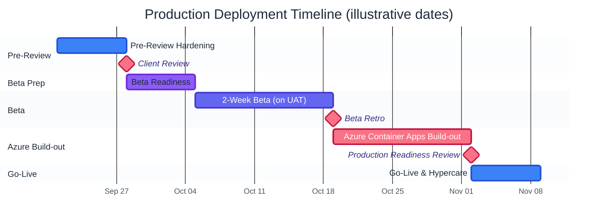

# Production Deployment Plan

**Status:** Draft for review
**Last updated:** 2026-09-18

Sequence: **Client Review → Beta Readiness → 2-Week Beta → Beta Retro →
Azure Production Build-out → Go-Live**. Weeks below are relative to
whatever kickoff date you pick (Week 1 = the week you start on this),
not fixed calendar dates - there's no real start date to anchor to yet.

Two scope decisions already made, both baked into this plan:

- **Azure target: Container Apps.** The app already builds Docker images
  and pushes them to a registry (GHCR) via GitHub Actions - Container
  Apps runs those same images with the least rearchitecture, managed
  TLS/scaling, and no cluster to operate. (App Service would mean
  splitting frontend/backend into separate services instead of one
  Compose-style stack; AKS is real infrastructure ops for an app this
  size - neither was picked.)
- **Employee Onboarding stays fully excluded** through client review,
  beta, and initial go-live - it's fully built and verified (see
  `docs/employee-onboarding-prd.md`) but deliberately hidden behind
  `Sidebar.tsx`'s `ONBOARDING_NAV_ENABLED = false` flag, per "push to
  next release." None of its still-open TODO items (Entra `hr` group,
  Dept Head sign-off, batch-mode removal, etc.) are on this plan's
  critical path - they belong to that feature's own future release.

## Acceptance Criteria

What "accepted for production use" actually means, in numbers, not just
a vibe. These are the real thresholds evaluated at the **Beta Retro**
(go/no-go for starting the Azure build-out) and **Production Readiness
Review** (final go/no-go for go-live) milestones below - not a separate
wishlist sitting apart from the rest of this plan.

Where something isn't measurable with what exists in the app today,
that's called out rather than left implied - a target nobody can
actually check isn't a target.

### User Goals (evaluated at Beta Retro)

| Goal | Target | How it's measured |
|---|---|---|
| Satisfaction | **≥ 80%** | A short end-of-beta survey (3 questions, 1-5 scale) - % of respondents rating 4 or 5. Nothing like this exists yet; needs to be built or picked (even a plain Microsoft Form) during Beta Readiness, not improvised at Beta Retro. |
| Adoption | ≥ 90% of the beta group files at least one real ticket through the portal during the 2 weeks | Query `tickets.requester_id` against the beta roster - no new tooling needed, this is already in the database. |
| SLA adherence | ≥ 85% of beta-filed tickets resolved/responded within their computed SLA deadline | Already tracked - every ticket already gets an `sla_deadline` at creation (`sla_deadline_for_priority`); this is a query against existing data, not new instrumentation. |
| Usability complaints | Zero left untriaged at Beta Retro | Every "I can't figure out how to..." piece of feedback (via the Feedback ticket Category from Beta Readiness) gets a disposition - fixed, explained, or explicitly deferred. Doesn't require all of them to be *fixed*, just none silently dropped. |

### Technical Goals (evaluated at Beta Retro *and* Production Readiness Review)

| Goal | Target | How it's measured |
|---|---|---|
| Uptime | ≥ 99% during the beta window | The same `journalctl`/health-endpoint monitoring already used for every deploy this project - no new observability stack needed for this. |
| Unhandled errors | Zero raw 500s reaching a real user | Directly depends on the `status`/`priority` validation fix already scheduled in Beta Readiness - this goal is the reason that fix is must-fix, not should-fix. |
| Open critical bugs | Zero P1/critical-severity bugs open | Whatever severity scheme the Beta Retro triage uses (see that milestone below) - this is the actual gate, not just "triaged." |
| RBAC correctness | 100% of beta participants resolve to their intended role on login | No repeat of the Candace VanHorn/Shanika Kimber/Margaret McGaugh Entra-group gap discovered and closed 2026-09-17/18 - confirm the full beta roster's Entra group membership matches intended app role *before* beta starts, not after someone reports it. |
| Page responsiveness | Dashboard and ticket list render in a reasonable time on a typical connection | Soft target, not a formal SLA - there's no load-testing tool in this project yet. Covered by the "basic smoke/load sanity" step already in the Azure Build-out phase; if this needs to become a hard number, that's a real tool to add, not a number to guess at now. |
| Mobile core flows | File a ticket and check ticket status work without visible breakage | On at least iOS Safari and Android Chrome specifically - the two a beta group will actually be holding, not an exhaustive device matrix. Covered by the mobile spot-check already in Beta Readiness. |

## Timeline

Dates below are illustrative (anchored on the next Monday from today,
2026-09-18) to give the chart real durations to render - not a committed
start date. Shift the whole chart once a real kickoff date is picked;
the phase order and relative durations are what actually matters here.

Mermaid Gantt bars don't support a true multi-stop gradient *fill* (no
supported hook to inject an SVG `linearGradient`) - what reads as
"gradient" here instead is a graduated color progression across the
phases (indigo → blue → violet → amber → emerald, left to right), with
every go/no-go gate styled consistently in rose regardless of where it
falls, so gates are instantly recognizable as the same *kind* of thing
wherever they appear on the chart.

Color key: **indigo** = the default working-phase color (2-Week Beta),
**blue** = active/near-term focus (starts now, and "we're live"),
**violet** = Beta Readiness (prep work, deliberately distinct from the
beta itself), **rose** = every go/no-go gate *and* the Azure build-out -
the single highest-risk, most infrastructure-heavy chunk of this plan,
flagged the same way the gates are on purpose.

---

## Week 1: Pre-Review Hardening

Everything here is about making sure what the client sees on UAT is
current and stable - not new feature work.

- [ ] **Push everything currently sitting locally, unpushed.** As of this
      writing: the Glass Amber/Blue/Green dashboard themes, the 150/5000
      character caps on ticket title/description, the "Reset Nextgen
      Password"/"Scanner Not Working" issue-template edits, the ticket
      detail page's new "Created By" field (plus the mobile `flex-wrap`
      fix that went with it), and the Onboarding nav-hide flag. Run the
      same verification gate used all along this project (`tsc --noEmit`,
      `next build`, backend `import main`) one more time as a combined
      check before pushing, given the volume sitting unpushed.
- [ ] Confirm UAT (`https://uat.ticketing.dhc.org`) is the demo
      environment and is healthy post-push (the usual `journalctl` +
      health-check-endpoint watch already used for every deploy this
      project).
- [ ] Decide and rehearse the demo script with the client: ticket
      lifecycle (file → triage → assign → resolve), the Dashboard KPI
      cards (mention the new theme options live, if wanted), Admin
      Settings, role-based access. Onboarding is **not** demoed as a live
      feature per the scope decision above - if you want to mention it's
      built and coming, that's a slide/conversation, not a nav item.
- [ ] Log any client change requests as new `docs/TODO.md` items rather
      than acting on them mid-review - same discipline used for every
      request this project so far.

## Milestone: Client Review

Gate, not work. Outcome: scope confirmed (or adjusted), go/no-go to
start Beta Readiness.

## Week 2: Beta Readiness

The goal here is narrow: fix what would actually embarrass the app or
block real employees during the beta, not clear the whole backlog.
Grounded in `docs/TODO.md`'s current open items - each line below maps
to a real one, not a generic pre-launch checklist.

**Must-fix before beta:**
- [ ] `TicketUpdate.status`/`.priority` aren't validated - an invalid
      value 500s instead of cleanly 422ing. Low effort (the same
      `field_validator` pattern already used for `intake_channel`), but
      a real risk of a raw 500 reaching a beta user's screen if anything
      sends a bad value (a typo'd manual API call, a future MCP misuse).
- [ ] Review Azure AD RBAC - confirm who's actually in
      `ITHelpdesk-Admins`/`ITHelpdesk-Technicians` before opening access
      to a beta group; you don't want to find out who has admin during
      the beta itself.
- [ ] Finish the two pending Entra group adds already on the TODO list -
      **Candace VanHorn** and **Shanika Kimber** were both set to
      `technician` in-app on 2026-09-17, but neither is in the
      `ITHelpdesk-Technicians` Entra group yet. If either logs in for
      real before that's done, their role silently reverts to
      `requester` on that first login - exactly the kind of confusing
      bug a beta tester would report as "the app is broken," not
      "my Entra group is wrong."

**Should-fix, time permitting (not blocking):**
- [ ] Quick mobile spot-check on the ticket detail and tickets-list
      pages specifically (real employees will likely open this on a
      phone at least once during beta) - not the full "General mobile
      web UI pass" TODO item, just enough to catch anything as visibly
      broken as the Technician Actions row overflow just fixed this
      session.
- [ ] The "ticket provenance" TODO item is now partially addressed by
      the new "Created By" field - re-read that TODO entry and decide if
      it's closable as-is or still wants the combined single-line
      treatment it originally described.

**Explicitly not in scope for beta readiness:** the Knowledge Base
module, the User Management page removal decision, and every
Onboarding-specific TODO item - none block a beta of the core ticketing
system.

**Beta operational prep:**
- [ ] Confirm/recruit the beta group - a small mix of roles (a couple of
      technicians, at least one admin, a handful of plain requesters)
      rather than all one role, so the beta actually exercises
      role-based behavior.
- [ ] Decide feedback capture. Simplest option, and a nice dogfood test:
      a "Feedback" ticket Category (admin-managed already, zero new
      code) so beta feedback flows through the same system being tested.
- [ ] Share a short "known issues" note pulled from `docs/TODO.md`'s
      still-open items, so beta feedback doesn't duplicate what's
      already tracked.
- [ ] Confirm outbound mail is intentional for beta, not a surprise -
      real ticket notification emails will go to real beta
      participants' inboxes (Graph/SMTP mail sending is already live,
      not simulate-mode, confirmed multiple times this project). That's
      presumably the point of a beta, just worth saying out loud given
      the real-email-during-testing incident earlier this project
      (a test onboarding batch's notification reached Margaret McGaugh
      for real, 2026-09-15/16) - not a repeat of that, just a reminder
      that "beta" here means real inboxes, not a sandbox.

## Weeks 3–4: Beta (2 weeks)

Runs on the existing UAT/Proxmox environment - the Azure migration
happens *after* beta per your own sequencing, not before, so there's no
new infrastructure to stand up just for this.

- [ ] Light-touch daily/weekly health checks during the beta window
      (same `journalctl`/health-endpoint pattern already used for every
      deploy - no new monitoring stack needed for a 2-week, small-group
      beta).
- [ ] A midpoint (end of week 3) check-in rather than waiting the full
      two weeks to hear about anything urgent.
- [ ] Triage feedback into `docs/TODO.md` continuously as it comes in,
      tagged by rough severity, rather than batching it all to the end.

## Milestone: Beta Retro

Score against the **User Goals** and **Technical Goals** tables above -
this is the actual go/no-go gate, not a vibe check. Then triage
everything else collected into three buckets: **must-fix before
go-live**, **fine to ship and iterate on post-launch**, and
**deferred/future release** (Onboarding's own backlog lives here by
default). Go/no-go decision for starting the Azure build-out.

## Weeks 5–6 (estimate): Azure Production Build-out

This is the largest real unknown in this plan - a genuine infrastructure
migration, not incremental feature work, so treat these durations as
rough until the specific Azure subscription/tenant setup is confirmed.

- [ ] **Provision core Azure resources**: a Resource Group, an Azure
      Container Apps environment, Azure Database for PostgreSQL
      (Flexible Server) replacing the current self-managed Postgres
      container, and Azure Key Vault for secrets - replacing the plain
      `.env.uat`-style file that currently lives directly on the UAT
      VM's filesystem. Real upgrade, not just a move: production
      secrets in a plaintext file on a VM is a fine UAT tradeoff, not a
      production one.
- [ ] **Registry**: decide whether to keep pushing images to GHCR (works
      fine, Container Apps can pull from it) or move to Azure Container
      Registry for tighter same-cloud integration - not a blocking
      decision, but pick one deliberately rather than defaulting.
- [ ] **TLS/domain**: a real certificate on the production domain,
      replacing Caddy's self-signed cert on UAT (the one every `curl -k`
      in this project's deploy checks has been working around). Container
      Apps' managed certificates handle this without needing Caddy at
      all in the new environment.
- [ ] **Entra app registrations**: add the production domain's redirect
      URI to the existing "IT Ticketing System - Web" app registration
      (or decide it needs its own prod-specific registration - a real
      decision point, not obviously one or the other). Confirm
      `ENTRA_ADMIN_GROUP_ID`/`ENTRA_TECH_GROUP_ID` (and `ENTRA_HR_GROUP_ID`
      once that group exists for the later Onboarding release) are the
      same tenant groups already in use, unless you specifically want
      separate prod-vs-UAT security groups.
- [ ] **New CI/CD path**: `deploy-uat.yml`'s deploy job runs on a
      self-hosted GitHub Actions runner living on the UAT VM itself -
      that whole mechanic doesn't exist for Container Apps. A new
      `deploy-prod.yml` (or an extended workflow) using
      `az containerapp update`/the Azure Container Apps GitHub Action
      replaces it, likely gated on manual approval or a tag/release
      trigger rather than every push to `main` the way UAT's is.
- [ ] **Data**: decide - and this needs a real decision, not a default -
      whether production starts from an empty database (real
      Entra-driven user provisioning on first login, no carried-over
      test/seed data) or needs some subset of UAT's data migrated
      forward. Recommendation: start clean. UAT has accumulated a lot of
      test/demo data (seeded accounts, test tickets, throwaway onboarding
      batches) that has no place in production.
- [ ] **Mail sending**: confirm the production FROM address/display name
      is finalized (not UAT-labeled), and that Graph/SMTP credentials
      for production are their own app registration, not reused UAT
      credentials.
- [ ] Basic smoke/load sanity before go-live - not a full performance
      test, just confirming the new environment behaves under light
      concurrent use before real users depend on it.

## Milestone: Production Readiness Review

Final go/no-go. Re-check the **Technical Goals** table above against
the new Azure environment specifically (uptime/error-rate goals reset
against production infrastructure, not carried over from UAT's beta
numbers), plus: health checks passing on the new environment, RBAC
groups correct, secrets actually in Key Vault (not plaintext anywhere),
TLS valid on the real domain, a backup/restore plan exists for the new
managed Postgres, and a rollback plan exists (can UAT keep serving
traffic if the Azure cutover needs to be reverted?).

## Go-Live

- [ ] DNS/domain cutover to the new Azure environment.
- [ ] Communicate go-live to real users; UAT reverts to being an actual
      staging environment again, not a stand-in for production.
- [ ] A hypercare period (heightened monitoring for the first several
      days) rather than walking away immediately after cutover.
- [ ] Resume the deferred backlog: the Employee Onboarding release
      (flip `ONBOARDING_NAV_ENABLED`, work its own remaining TODO items
      first) and the Knowledge Base module are the two clear next
      pieces of work once production is stable.
